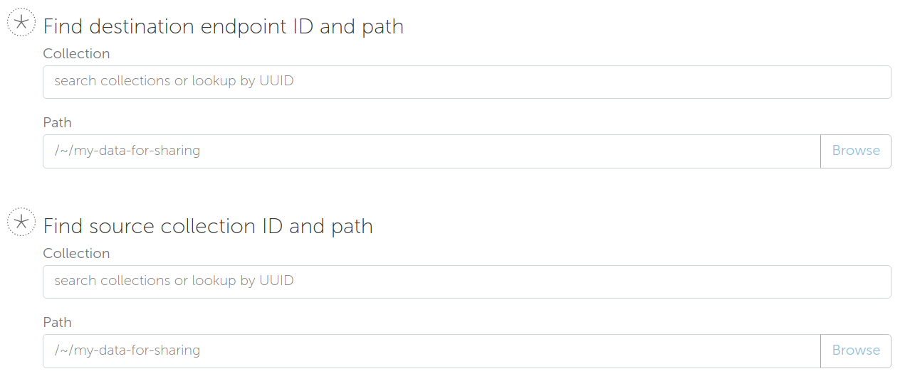

.. _flows_authoring:

Authoring Flows for the Globus Flows Service
============================================

The Globus Flows Service provides users with the ability to easily define
compositions of Actions (henceforth referred to as Flows) to perform a single,
logical operation. Definition of such Flows requires an easy to read, author,
and potentially visualize method of defining the Flows. For this purpose, the
Flows service starts from the core of the `Amazon States Language
<https://states-language.net/spec.html>`_. In particular, the general structure
of a Flow matches that of a States Language State Machine in particular matching
the requirements defined for `Top-Level Fields
<https://states-language.net/spec.html#toplevelfields>`_ including the
properties:

* ``States``

* ``StartAt``

* ``Comment``

Additionally, general concepts from the States Language and its method of
managing state for the State Machine/Flow are maintained. Concepts such as
`Input and Output Processing <https://states-language.net/spec.html#filters>`_
are handled in the same manner (see note below for an important exception). In
particular, paths within the state of the Flow are referenced with a ``$.``
prefix just as defined in the States Language.

The following state types are supported in Flows in nearly (see note
below) the same manor as defined in the States Language:

* `Pass <https://states-language.net/spec.html#pass-state>`_

* `Choice <https://states-language.net/spec.html#choice-state>`_

* `Wait <https://states-language.net/spec.html#choice-state>`_

* `Fail <https://states-language.net/spec.html#fail-state>`_

.. note::

   The exception is the use of the ``OutputPath`` property in
   the ``Pass`` or ``Choice`` states. ``OutputPath`` is not allowed in
   a Flow definition. Instead, the ``ResultPath`` must always be used
   to specify where the result of a state execution will be stored
   into the state of the Flow.

Other state types defined in the Amazon States Language are not supported and will be rejected at deployment time. The Flows system adds two new state types ``Action`` and ``ExpressionEval`` for invoking Actions and updating the state of a running Flow via an expression language. These are defined below.

``Action`` State type
---------------------

As Actions are the core building block for most concepts in Globus Automate,
Action invocation takes on a central role in the definition of Flows. Actions
are invoked from a Flow using the state type ``Action``. We describe the
structure of an ``Action`` state via the following example which is described in
detail below:

.. code-block:: JSON

    {
      "Type": "Action",
      "ActionUrl": "<URL to the Action, as defined above for various Actions>",
      "InputPath": "$.Path.To.Action.Body",
      "Parameters": {
        "constant_val": 10,
        "reference_value.$": "$.Path.To.Value",
        "expression_value.=": "'Constant string ' + Path.To.SuffixString",
        "nested_value": {
          "child_const_val": true,
          "child_ref_val.$": "$.Child.Val.Path"
        },
        "secret_value": "MyPassword",
        "__Private_Parameters": ["secret_value"]
      },
      "ResultPath": "$.ActionOutput",
      "WaitTime": 3600,
      "ExceptionOnActionFailure": true,
      "RunAs": "User",
      "Catch": [
        {
          "ErrorEquals": ["ActionUnableToRun"],
          "Next": "RunFailureHandler"
        },
        {
          "ErrorEquals": ["ActionFailedException"],
          "Next": "ActionFailureHandler"
        }
      ],
      "Next": "FollowingState",
      "ActionScope": "<Scope String for the Action, as defined above for various Actions>",
      "End": true
    }

The properties on the ``Action`` state are defined as follows. In some
cases, we provide additional discussion of topics raised by specific properties
in further sections below this enumeration.

* ``Type`` (required): As with other States defined by the States Language, the ``Type`` indicates the type of this state. The value ``Action`` indicates that this state represents an Action invocation.

*  ``ActionUrl`` (required): The base URL of the Action. As defined by the Action Interface, this URL has methods such as ``/run``, ``/status``, ``/cancel`` and so on defined to manage the life-cycle of an Action. The Action Flow state manages the life-cycle of the invoked Action using these methods and assumes that the specific operations are appended to the base URL defined in this property. For Globus operated actions, the base URLs are as defined previously in this document.

*  ``InputPath`` or ``Parameters`` (mutually exclusive options, at least one is required): Either ``InputPath`` or ``Parameters`` can be used to identify or form the input to the Action to be run as passed in the ``body`` of the call to the action ``/run`` operation.

   *  ``Parameters``: The Parameters property is defined as an object that becomes the input to the Action. As such, it becomes relatively plain in the ``Action`` state definition that the structure of the ``Parameters`` object matches the structure of the body of the input to the Action being invoked. Some of the fields in the ``Parameters`` object can be protected from introspection later so that secret or sensitive information, such as credentials, can be encoded in the parameter values without allowing visibility outside the flow, including by those running the Flow. The private parameter functionality is described in `Protecting Action and Flow State`_. Values in ``Parameters`` can be specified in a variety of ways:

      *  **Constants**: Simply specify a value which will always be passed for that property. Constants can be any type: numeric, string, boolean or other objects should an action body specify sub-objects as part of their input. When an object is used, each of the properties within the object can also be of any of the types enumerated here.

      *  **References**: Copies values from the state of the flow to the name given. The name must end with the sequence ``.$`` to indicate that a reference is desired, and the string-type value must be a `Json Path <https://goessner.net/articles/JsonPath/>`_ starting with the characters ``$.`` indicating the location in the Flow run-time state that values should be retrieved from.

      *  **Expressions**: Allow values to be computed as a combination of constants and references to other state in the Flow's run-time. This provides a powerful mechanism for deriving parameter values and is defined more fully below in `Expressions in Parameters`_

   *  ``InputPath``: Specifies a path within the existing state of the Flow here the values to be passed will be present. Thus, use of ``InputPath`` requires that the proper input be formed in the Flow state.

*  ``ResultPath``: Is a `Reference Path <https://states-language.net/spec.html#ref-paths>`_ indicating where the output of the Action will be placed in the state of the Flow run-time. The entire output returned from the Action will be returned including the ``action_id``, the final ``status`` of the Action, the ``start_time`` and ``completion_time`` and, importantly, the ``details`` containing the action-specific result values. If ``ResultPath`` is not explicitly provided, the default value of simply ``$``, indicating the root of the Flow state, is assumed and thus the result of the Action will become the entire Flow state following the ``Action`` state's execution. Typically this is not the desired behavior, so a ``ResultPath`` should almost always be included.

*  ``WaitTime`` (optional, default value ``300``): The maximum amount time to wait for the Action to complete in seconds. Upon execution, the Flow will monitor the execution of the Action for the specified amount of time, and if it does not complete by this time it will abort the Action. See `Action Execution Monitoring`_ for additional information on this. The default value is ``300`` or Five Minutes.

*  ``ExceptionOnActionFailure`` (optional, default value ``true``): When an Action is executed but is unable complete successfully, it returns a ``status`` value of ``FAILED``. It is commonly useful to treat this "Action Failed" occurrence as an Exception in the execution of the Flow. Setting this property to ``true`` will cause a Run-time exception of type ``ActionFailedException`` to be raised which can be managed with a ``Catch`` statement (as shown in the example). Further details on discussion of the ``Catch`` property of the Action state and in the `Managing Exceptions`_ section. If the value is ``false``, the status of the Action, including the value of ``FAILED`` for the status value will be placed into the Flow state as referenced by ``ResultPath``.

*  ``RunAs`` (optional, default value ``User``): When the Flow executes the Action, it will, by default, execute the Action using the identity of the user invoking the Flow. Thus, from the perspective of the Action, it is the user who invoked the Flow who is also invoking the Action, and thus the Action will make authorization decisions based on the identity of the User invoking the Flow. In some circumstances, it will be beneficial for the Action to be invoked as if from a user identity other than the user who invoked the Flow. See `Identities and Roles, Scopes and Tokens`_ for additional information and a discussion of use cases for providing different ``RunAs`` values.

*   ``Catch``: When Actions end abnormally, an Exception is raised. A ``Catch`` property defines how the Exception should be handled by identifying the Exception name in the ``ErrorEquals`` property and identifying a ``Next`` state to transition to when the Exception occurs. If no ``Catch`` can handle an exception, the Flow execution will abort on the Exception. A variety of exception types are defined and are enumerated in `Managing Exceptions`_.

*  ``ActionScope`` (optional): The scope string to be used when authenticating to access the Action. In most cases, this values is unneeded because the required scope can be determined by querying the Action Provider using the provided ``ActionUrl``. If you are using a non-standard compliant Action which does not publish its ``scope``, this can be provided to avoid attempting to query the non-compliant Action provider.

*   ``Next`` or ``End`` (mutually exclusive, one required): These indicate how the Flow should proceed after the Action state. ``Next`` indicates the name of the following state of the flow, and ``End`` with a value ``true`` indicates that the Flow is complete after this state completes.

Protecting Action and Flow State
--------------------------------

At times, portions of a Flow state may need to be secret or protected from the
various operations, like status and log, which can be used to monitor and
observe the state of a Flow execution. For example, some Actions may require
credentials or keys to authenticate or permit access. These items should not be
visible to some users, particularly when they are encoded (e.g. in Parameter
constants) by the Flow author. There are two areas where these values may be
stored or encoded: in ``Parameters`` to Actions, and within the state of the
Flow at run-time. The service provides mechanisms for protecting information in
both cases.

For ``Parameters``, a list with special property name ``__Private_Parameters``
may be placed in the ``Parameters`` object indicating which other Parameters
should be protected. These values will be protected in two ways:

* Users that lookup the Flow in the service will not see the ``Parameters`` which are specified in the ``__Private_Parameters`` list unless the have the ``flow_administrator`` or ``flow_owner`` role on the Flow.

* When the state of a run of the Flow is returned, values for these ``Parameters`` will not be returned in the status or log of the Flow's execution.

For simplicity, the values in the ``__Private_Parameters``
list may include the "simple" name even when the parameter name is a Reference
or Expression. For example, if a parameter value has the form ``"SecretValue.$":
"$.Path.To.Secret"`` the value in the ``__Private_Parameters`` list may be
simply ``SecretValue`` omitting the trailing ``.$`` which identifies the
parameter as a reference. Similarly for expression parameters, the trailing
``.=`` may be omitted.  The ``__Private_Parameters`` list may be applied at any
nesting level of the Parameters. Thus, in the following ``Parameters``
definition:

.. code-block:: JSON

    {
      "Parameters": {
        "server_info": {
          "URL": "https://example.com",
          "user_name": "FlowUser",
          "password": "my_password",
          "__Private_Parameters": ["password"]
        }
      }
    }

The ``password`` property within the ``server_info`` object would be omitted
from output of any state of the Flow retrieved by any user.

To protect the state of the Flow's run-time, any property which starts with the
prefix ``_private`` will be omitted from Flow introspection. Thus, if protected
values need to be stored within the Flow state, they could be stored in a
property with a name like ``_private_secret_property`` or in an object simply
having the name ``_private`` as that object, starting with the prefix will
entirely be omitted from the output. As an example, the following flow state
would not be visible:

.. code-block:: JSON

    {
      "_private": {
          "user_name": "FlowUser",
          "password": "my_password",
      }
    }

However, the properties *MAY* still be referenced as part of a reference path
such as in an Action parameter. Thus, the reference path
``$._private.password`` could be used and the value ``my_password`` would be
used for the parameter. In such a case, that parameter would also most likely
need to appear in the ``__Private_Parameters`` list to prevent the value from
being shown when the state of the particular Action is displayed to a user.
Thus, the state protection via ``_private`` property names and the enumeration
of protected parameters via ``__Private_Parameters`` will often be used in
tandem.

.. _flow_action_expressions:

Expressions in Parameters
-------------------------

Action Parameters allow the inputs to an Action to be formed from different
parts of the Flow run-time state. However, the reference approach requires that
the exact value needed be present in the Flow's state. If the required value is
somehow to be derived from multiple values in the Flow state, reference
parameters are not sufficient. Thus, we introduce expression type parameters
which may evaluate multiple parts of the state to compute a single, required
value.

The syntax of an expression paramter takes the following form:

.. code-block:: JSON

    {
      "computed_param.=": "<state_val1> <op> <state_val2> <op> ..."
    }

The syntax for the expression largely follows what is expected in common
expression languages. This includes common arithmetic operators on numeric
values as well as operations on strings (e.g. string concatenation via a `+`
operation) and on lists (similarly the `+` operator will concatenate lists).

The values in the state of the flow may be used in the expression and are denoted as ``<state_valN>`` above. For the following description, assume that the input to (or current state of) a Flow Run is as follows:

.. code-block:: JSON

    {
      "foo": "bar",
      "list_val": [1, 2, 3],
      "object_val": {
        "sub_val1": "embedded",
        "sub_val2": "also_embedded"
      }
    }

The ``state_val`` values can be specified as the simple names of the properties
in the state of the running flow and allows for indexing into lists and into
embedded objects similar to Python. Thus, the following would be a valid
expression: ``foo + ' ' + object_val.sub_val1`` which would yield the string
``bar embedded``. Note the use of ``+`` to mean string concatenation and the
dot-separated naming of the field of the object.

Constants may also be used between operators, it is important to
remember that within an expression, a string type value must be enclosed in
quotes (either single quote characters as above which is often easier because they do not need to be escaped within a JSON string or double quotes).

Using Functions in Expressions
^^^^^^^^^^^^^^^^^^^^^^^^^^^^^^

In addition to basic arithmetic operations, a few *functions* may be used. Functions are invoked with the general form: ``function_name(param1, param2)``. Thus, an expression may, for example, take the form ``val1 + function(param1)``. The functions currently supported are:

* ``pathsplit``: This function may be used to break apart a "path" type string value. Paths are a series of path element names separated by `/` characters. The return value from the ``pathsplit`` function is an array of two elements: the first element is the path prior to the last element. This is also aware of a special "root path" of the form ``/~/`` as defined by Globus Transfer so that this string will never be "split". Examples:

  * ``pathsplit("/foo/bar/blech")`` returns ``["/foo/bar", "blech"]``
  * ``pathsplit("/~/path")`` returns ``["/~/", "path"]``

* ``is_present``: This function checks for the existence of a value in the state of the input Parameters. It is similar to the `IsPresent <https://docs.aws.amazon.com/step-functions/latest/dg/amazon-states-language-choice-state.html>`_ operator in the Amazon States Language. It takes in a reference to a value in the state, *as a string*, and returns ``true`` if the value exists, and ``false`` if not. This can be used to insure that a value is present before using it in a further expression such as: ``x if is_present('x') else 10`` which would use the conditional expression to check for presence of the property ``x`` and sets a constant if it is not present. This helps to avoid accessing properties that are not defined which would cause an error.

* ``getattr``: This function will return a value from the state of the input if it is present, and, optionally, a default value if it is not present. Examples:

  * ``getattr('x', 10)``: returns the value of property ``x`` if it is present, and the constant 10 if not (equivalent to the ``is_present`` example above.

  * ``getattr('missing_property')``: Would return a ``null` value if the ``missing_property`` value is not present in the state.

Identities and Roles, Scopes and Tokens
---------------------------------------

The ``RunAs`` property of an ``Action`` state can be used to control the identity associated with executing the Action. In most cases, it will be appropriate to have the Action invoked as the same identity that invoked the Flow. This is the default behavior, so no value for ``RunAs`` is needed to get this behavior. However, other scenarios may require a single Flow execution to invoke various Actions using different identities or roles. The ``RunAs`` property of the ``Action`` state provides two additional types of roles that can be specified:

*  ``Flow``: When the value is ``Flow``, the Action will be invoked as the identity of the Flow itself. Because every Flow is registered with the Globus Auth system so that it can authenticate requests to be run, it also has a unique identity in Globus Auth. This identity can be used to invoke other Actions. Thus, once the Flow is deployed, the Globus Auth identity of the Flow is known, and can be configured in the authorization state of various Actions for permission. To help with this form of configuration, the information provided by a flow using the command ``globus-automate flow list`` or ``globus-automate flow display`` includes two properties which help identity the Flow. The first is ``principal_urn`` which provides the URN form of the identity for the Flow which is used by many Actions and other Globus services to specify identities. The other property is ``globus_auth_username`` which is another common method of naming a Globus Auth identity.

* An arbitrary "role name" can also be specified as in ``"RunAs": "AdminUser"``. The identity for this role will be determined by an additional Globus Auth access token which is passed into the Flow at run-time as part of the initial state. The flows service will use this token when invoking the Action and so the Action will see the request as if coming from the user associated with this token. We describe how these role-specific tokens are passed next.

.. note::

   When a Flow is run, the identity of the running user is determined
   by examining the token passed on the header of the HTTP request,
   and, as described in the next section, other tokens may be passed
   in the body of the request. In either case, the Flows service will
   validate the token by interacting with the Globus Auth
   service. These interactions with Globus Auth require additional
   time when a Flow is being started. To help alleviate this overhead,
   the Flows service will retain (cache) results from token validity
   checks for up to 30 seconds. That is, if the same token is
   presented more than once within 30 seconds, the results from the
   previous check will be re-used.

   Thus, if a user should request that a token's validity be
   rescinded, it is _possible_ that use of the token may be considered
   valid for up to 30 seconds after the time the user rescinds the
   token's validity.

Providing Role-Specific Tokens
^^^^^^^^^^^^^^^^^^^^^^^^^^^^^^

When ``RunAs`` specifies a role name, corresponding tokens must be generated and provided to the Flow at run-time. The necessary information to generate any Globus Auth token is the name of the scope to which the token should be generated. So that generated tokens are as specific as possible, the Flows service creates a separate scope for each role which appears as part of a ``RunAs`` property. These scope strings are present in the Flow description under the property ``globus_auth_scopes_by_RunAs``. This will be a JSON object with the property names matching the roles named in ``RunAs`` and the values being the Globus Auth scope string. For example, if roles named ``Admin`` and ``Curator`` were present in the Flow definition, the Flow description would contain an object like:

.. code-block:: JSON

   {
     "Admin": "<Globus Auth Scope String for Admin>",
     "Curator": "Globus Auth Scope String for Curator>"
   }

When invoking the Flow (e.g. via ``globus-automate flow run``) the flow input would be required to contain the access tokens for each of the roles in a similar JSON object called ``_tokens`` as follows:

.. code-block:: JSON

   {
     "_tokens": {
       "Admin": "<Globus Auth access token for Admin>",
       "Curator": "Globus Auth access token for Curator>"
     }
   }

.. note::
   If the author of a Flow provides an ``input_schema`` for their Flow, the schema should specify that the ``_tokens`` property should be present with this structure. Otherwise, the Flows service will reject the input prior to running the Flow.

The method for generating the required tokens is outside the scope of this document. The approach will use of the `Globus Auth API <https://docs.globus.org/api/auth/>`_ and typically the `Globus SDK <https://globus-sdk-python.readthedocs.io/en/latest/>`_. In particular, the `section on obtaining tokens <https://globus-sdk-python.readthedocs.io/en/latest/tutorial.html#step-3-get-some-access-tokens>`_ is a good starting point.

Action Execution Monitoring
---------------------------

``Action`` states will block until the executed action reaches a
completion state with status value either ``SUCCEEDED`` or ``FAILED``
or when the ``WaitTime`` duration is reached. Within this time, the
Flow will periodically poll the Action to determine if it has reached
a completion state.  The interval between polls doubles after each
poll ("exponential back-off") up to a maximum interval between polls
of 10 minutes. Thus, detection of the completion will not be
instantaneous compared to when the action "actually" completes and may
be delayed up to the maximum poll interval of 10 minutes.

It is important to remember that this delay between an Action's actual
completion and it being detected by the Flow service can occur. A user
running a flow may observe or receive another form of notification
(such as an email from Globus Transfer) that an Action has completed
prior to the Flows service polling to discover the same progress has
occurred. This is an inherent property of the system.

Managing Exceptions
-------------------

Failures of Action states in the Flow are exposed via Exceptions which, as described above, can be handled via a ``Catch`` property on the Action state. The form of the ``Catch`` is as shown in the example, but the types of exceptions need to be discussed in more detail. There are three forms of exceptions that impact an Action execution:

* ``ActionUnableToRun``: This exception indicates that the initial attempt to run the Action failed and no action whatsoever was initiated. The output of the exception contains the error structure returned by the Action. This condition will always result in an exception.

* ``ActionFailedException``: This indicates that the Action was able initiated but during execution the Action was considered to have failed by the return of an Action status with the value ``FAILED``. This exception will only be raised if the property ``ExceptionOnActionFailure`` is set to true. This allows the Action failure to be handled by checking the result or by causing an exception. Either approach is valid and different users and different use cases may lend themselves to either approach. In either case, the output will contain the same Action status structure a completed action will contain, but the ``status`` value will necessarily be ``FAILED``.

* ``ActionTimeout``: When the ``WaitTime`` for an ``Action`` state is exceeded, this exception will be raised. The status of the most recent poll of the ``Action`` will be contained within the body of the exception.

Pre-Populated Run-time State
----------------------------

Basic information about the flow's state and the user invoking the Flow is provided through a "virtual", read-only property available at the JSONPath ``$._context``. This path may be used in a path for a ``Parameters`` value on an Action or Pass state type, or in expressions which are evaluated when generating ``Parameters`` values as described above. This allows the Flow to use these values as necessary for passing into Actions as parameters. As this is a read-only value, the ``_context`` cannot be overwritten by using the path in a ``ResultPath`` on any state. The ``_context`` value is itself an object
containing the following properties:

+---------------+-------------------------------------------------------------------------------------+
| Property name | Description                                                                         |
+===============+=====================================================================================+
| flow_id       | The id of the deployed Flow that is executing                                       |
+---------------+-------------------------------------------------------------------------------------+
| run_id        | The unique id assigned to **this execution** of the Flow                            |
+---------------+-------------------------------------------------------------------------------------+
| username      | The Globus Auth username for the user invoking the Flow                             |
+---------------+-------------------------------------------------------------------------------------+
| email         | The email address for the user invoking the Flow                                    |
+---------------+-------------------------------------------------------------------------------------+
| user_id       | The Globus Auth user id for the user invoking the Flow (in URN format)              |
+---------------+-------------------------------------------------------------------------------------+
| identities    | A list of all identities associated with the user invoking the Flow (in URN format) |
+---------------+-------------------------------------------------------------------------------------+
| token_info    | A child object containing the fields exp, iat, and nbf (described below)            |
+---------------+-------------------------------------------------------------------------------------+

The ``token_info`` fields are defined as follow:

* | ``exp``: Timestamp, measured in the number of seconds since January 1 1970
    UTC, indicating when this token will expire.

* | ``iat``: Timestamp, measured in the number of seconds since January 1 1970
    UTC, indicating when this token was originally issued.

* | ``nbf``: Timestamp, measured in the number of seconds since January 1 1970
    UTC, indicating when this token is not to be used before.

``ExpressionEval`` State type
-----------------------------

The ``Action`` state type provides a method of evaluating expressions to create Parameter values for passing to the action, and the ``Pass`` state, defined in the States Language, provides a means of moving or re-arranging the Flow's run-time state by specifying input Parameters and new locations via the ``ResultPath``. In some cases, the combination of the two capabilities is desired: the ability to compute results for Parameters as in the ``Action`` state and the simple storage of the new values, as in the ``Pass`` state. This is the role of the ``ExpressionEval`` state type. It can be thought of as an ``Action`` without the Action invocation, or a ``Pass`` where ``Parameters`` may contain expressions.

A primary situation in which this state type will be used is when determining a value to be tested in a ``Choice`` state type. The ``Choice`` state type can only read single values from the run-time state of the Flow, so if, for example, a value on which a ``Choice`` condition needs to be applied must be combined from separate parts of the Flow run-time state. The computed value can then be referenced in the ``Variable`` property of the Choice. Another use is to compute a "final" for the Flow to be stored in the state of the Flow and therefore seen in the output of the Flow upon completion.

An example structure for an ``ExpressionEval`` state is as follows:

.. code-block:: JSON

    {
      "Type": "ExpressionEval",
      "Parameters": {
        "constant_val": 10,
        "reference_value.$": "$.Path.To.Value",
        "expression_value.=": "'Constant string ' + `$.Path.To.SuffixString`",
        "nested_value": {
          "child_const_val": true,
          "child_ref_val.$": "$.Child.Val.Path"
        },
        "secret_value": "MyPassword",
        "__Private_Parameters": ["secret_value"]
      },
      "ResultPath": "$.final_result",
      "End": true
    }

All of the properties of the ``ExpressionEval`` state have the same meaning as described in the ``Action`` state. The ``ExpressionEval`` state cannot use the ``InputPath`` property (``Pass`` is appropriate if moving state from an ``InputPath`` to a ``ResultPath`` is needed), so ``Parameters`` must always be present. Just like in ``Action`` the ``Parameters`` may have constant, reference or expression types and portions of the state can be protected using a ``__Private_Parameters`` list. Like ``Action``, this state must have either a ``Next`` or an ``End: true``.

.. _example-flows-custom-format:

``Globus Web App Custom Formats``
---------------------------------

The `Globus web app`_ supports a JSON schema format in order to make starting flows a little more user friendly on the webapp.

``globus-collection``
^^^^^^^^^^^^^^^^^^^^^

``globus-collection`` as a ``format`` in your ``input_schema`` will signal to the webapp to show a custom input field for searching for and selecting a Globus collection on the Guided tab when starting a Flow.

This example input schema shows how to configure a basic Transfer flow using this format:

.. code-block:: JSON
    :emphasize-lines: 6,9-10,13-19

    {
        "additionalProperties": false,
        "properties": {
            "source": {
                "type": "object",
                "format": "globus-collection",
                "title": "Find source collection ID and path",
                "required": [
                    "id",
                    "path"
                ],
                "properties": {
                    "id": {
                        "type": "string",
                        "format": "uuid"
                    },
                    "path": {
                        "type": "string"
                    }
                },
                "additionalProperties": false
            },
            "destination": {
                "type": "object",
                "format": "globus-collection",
                "title": "Find destination endpoint ID and path",
                "required": [
                    "id",
                    "path"
                ],
                "properties": {
                    "id": {
                        "type": "string",
                        "format": "uuid"
                    },
                    "path": {
                        "type": "string"
                    }
                },
                "additionalProperties": false
            },
            "recursive": {
                "type": "boolean",
                "title": "Recursive transfer",
                "description": "Whether or not to transfer a directory recursively, must be true when transferring a directory."
            }
        },
        "required": ["source", "destination", "recursive"]
    }

The above will cause the Globus web application to display a set of inputs that map to the id and path fields for source and destination:

Important notes about the ``globus-collection`` format:
-------------------------------------------------------

* The properties inside ``globus-collection`` must be named "id" and "path"
* The ``required`` field inside ``globus-collection`` determines behavior of the component as follows:
   * If both "id" and "path" are required, the component will display and require both collection and path inputs
   * If only "id" is required, the component will only display the Collection input
   * If only "path" is required, the component will display both inputs but only the path field will be required. The collection input is provided to allow browsing of that collection's directory listing
* This format is used to provide a UI component for `Globus web app`_ and will not substantively affect Flow usage from the Automate CLI or programmatic access

.. _example-flows-details:

Example Flows
-------------

.. _example-flow-move:

"Move (Globus Example)"
^^^^^^^^^^^^^^^^^^^^^^^

Flow ID: ``9123c20b-61e0-46e8-9469-92c999b6b8f2``.

A Flow which performs a 'move' operation on a directory by first transferring
from a source to a destination and then deleting the directory from the source.
The entire directory's contents, including files and subdirectories, will be
moved to the destination and then removed from the source.

Note that this flow requires at least one of the collections to be managed under a Globus subscription.

View the `Move flow definition`_ in the Globus web app.
(You may need to log in first.)

.. code-block:: json
    :caption: Example Input

    {
        "source": {
          "id": "ddb59aef-6d04-11e5-ba46-22000b92c6ec",
          "path": "/~/source-directory"
        },
        "destination": {
          "id": "ddb59af0-6d04-11e5-ba46-22000b92c6ec",
          "path": "/~/destination-directory"
        }
        "transfer_label": "Transfer for Generic Move from Globus Tutorial Endpoint 1 to Globus Tutorial Endpoint 2",
        "delete_label": "Delete after Transfer for Generic Move from Globus Tutorial Endpoint 1 to Globus Tutorial Endpoint 2"
    }

(Choose different ``source.path`` and ``destination.path`` as needed to run this example flow.)

.. _example-flow-2-stage-transfer:

"2 Stage Transfer (Globus Example)"
^^^^^^^^^^^^^^^^^^^^^^^^^^^^^^^^^^^

Flow ID: ``79a4653f-f8da-43b6-a581-5d3b345ad575``.

Transfer from source to destination with an intermediate endpoint in-between.
Remove from intermediate after completion.

Note that this flow requires at least one of the collections to be managed under a Globus subscription.

View the `2 Stage Transfer flow definition`_ in the Globus web app.

.. code-block:: json
    :caption: Example Input

    {
        "source": {
          "id": "ddb59aef-6d04-11e5-ba46-22000b92c6ec",
          "path": "/~/ep1-example-directory/"
        },
        "intermediate": {
          "id": "ddb59af0-6d04-11e5-ba46-22000b92c6ec",
          "path": "/~/ep2-intermediate-directory/"
        },
        "destination__": {
          "id": "ddb59aef-6d04-11e5-ba46-22000b92c6ec",
          "path": "/~/ep1-duplicate-example-directory/"
        }
        "transfer1_label": "This value will be used as a label for the Globus Transfer Task to copy data from the source collection to the intermediate collection",
        "transfer2_label": "This value will be used as a label for the Globus Transfer Task to copy data from the intermediate collection to the destination collection"
    }

.. _example-flow-transfer-set-permissions:

"Transfer Set Permissions (Globus Example)"
^^^^^^^^^^^^^^^^^^^^^^^^^^^^^^^^^^^^^^^^^^^

Flow ID: ``cdcd6d1a-b1c3-4e0b-8d4c-f205c16bf80c``.

A Flow which performs a Transfer on a directory, gives a user READ permissions
on the destination directory and notifies the user of their new data via email.
The user running the Flow must have administration privileges over the
destination endpoint.

View the `Transfer Set Permissions flow definition`_ in the Globus web app.

.. code-block:: json
    :caption: Example Input

    {
        "source_endpoint_id": "ddb59af0-6d04-11e5-ba46-22000b92c6ec",
        "source_path": "/share/godata",
        "destination_endpoint_id": "ddb59aef-6d04-11e5-ba46-22000b92c6ec",
        "destination_path": "/~/my-godata",
        "transfer_label": "Transfer for Transfer Set Permissions Flow",
        "user_id": "06a24bef-940e-418a-97bc-48229c64cc99",
        "user_email": "uriel@globus.org"
    }

(Of course, adjust ``user_email`` as necessary if you want to test this flow.)

..  _Move flow definition: https://app.globus.org/flows/9123c20b-61e0-46e8-9469-92c999b6b8f2/definition
..  _2 Stage Transfer flow definition: https://app.globus.org/flows/79a4653f-f8da-43b6-a581-5d3b345ad575/definition
..  _Transfer Set Permissions flow definition: https://app.globus.org/flows/cdcd6d1a-b1c3-4e0b-8d4c-f205c16bf80c/definition
..  _Globus web app: https://app.globus.org/
